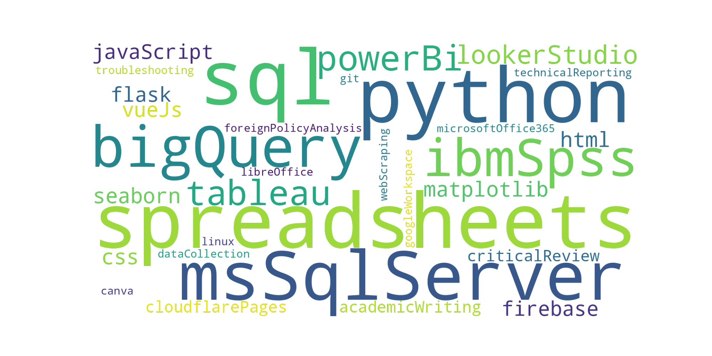

```python
from wordcloud import WordCloud
import matplotlib.pyplot as plt

# Define the skills, using camelCase
skills = [
    'spreadsheets', 'python', 'r', 'sql', 'msSqlServer', 'bigQuery', 'ibmSpss', 
    'powerBi', 'tableau', 'lookerStudio', 'matplotlib', 'seaborn', 'html', 
    'css', 'javaScript', 'flask', 'vueJs', 'firebase', 'cloudflarePages', 'academicWriting', 
    'criticalReview', 'foreignPolicyAnalysis', 'technicalReporting', 'dataCollection', 
    'webScraping', 'troubleshooting', 'linux', 'git', 'canva',
    'microsoftOffice365', 'googleWorkspace', 'libreOffice',
]

# Join the skills into a single string
skills_text = ' '.join(skills)

# Generate the word cloud
wordcloud = WordCloud(background_color=None, mode='RGBA').generate(skills_text)

# Display the word cloud
plt.imshow(wordcloud, interpolation='bilinear')
plt.axis('off')
plt.show()
```



