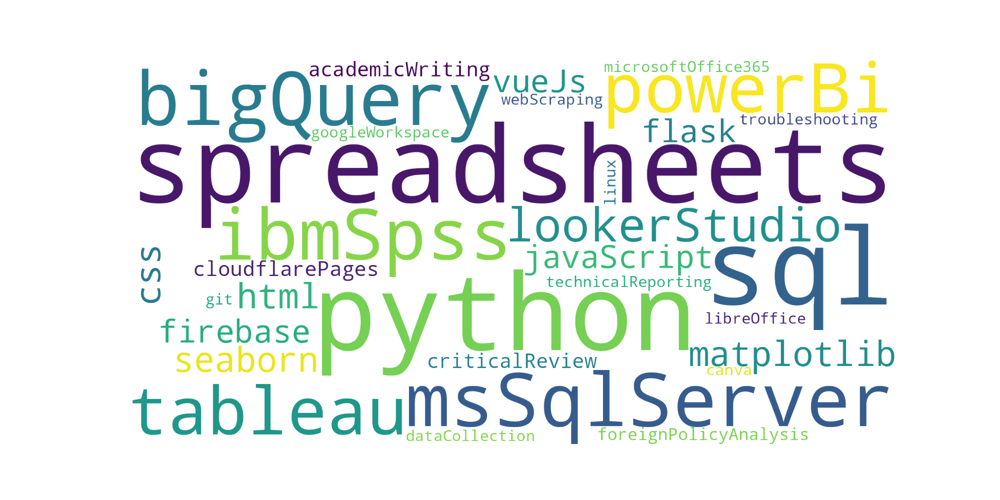

```python
from wordcloud import WordCloud
import matplotlib.pyplot as plt

skills = ['Python', 'SQL', 'RStudio', 'Spreadsheets', 'PowerBI', 'Tableau', 'HTML', 'CSS', 'Javascript', 'Vue']

skills_text = ' '.join(skills)

wordcloud = WordCloud(background_color=None, mode='RGBA',).generate(skills_text)

plt.imshow(wordcloud)
plt.axis('off')
plt.show()

```



